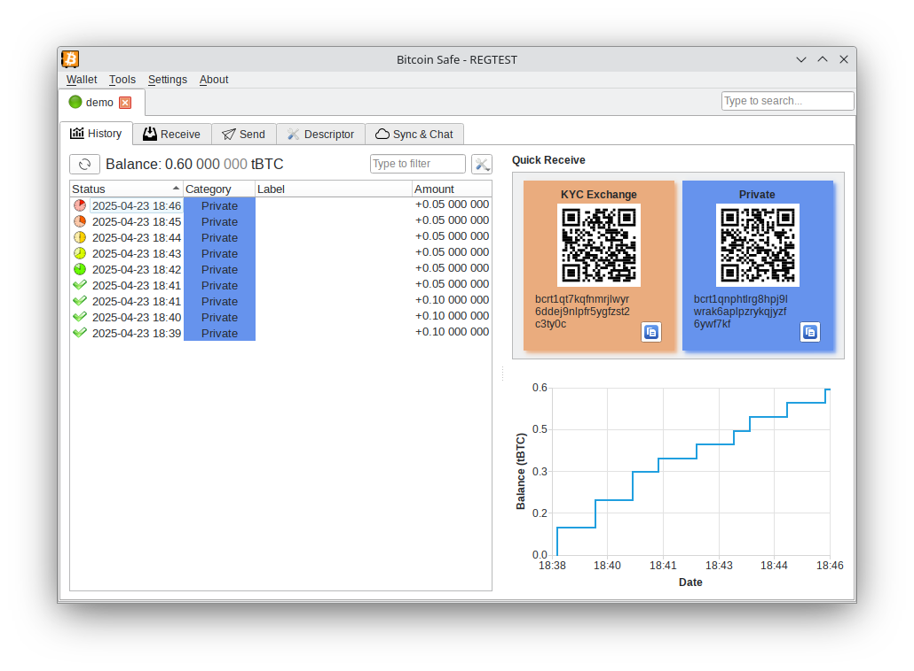
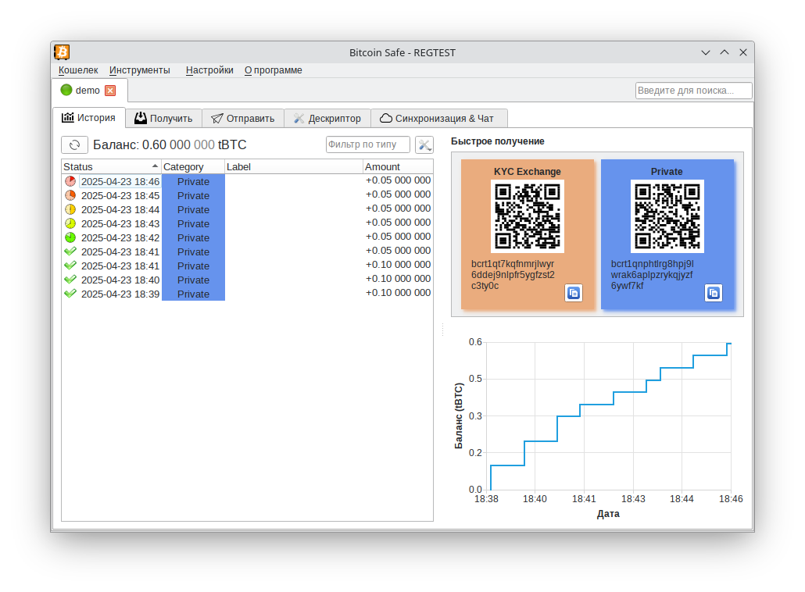
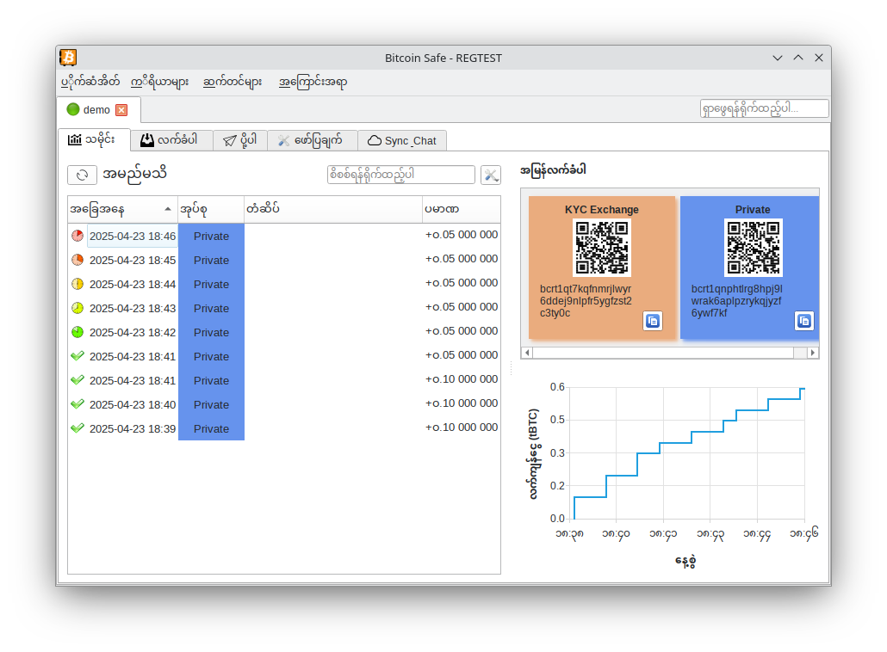
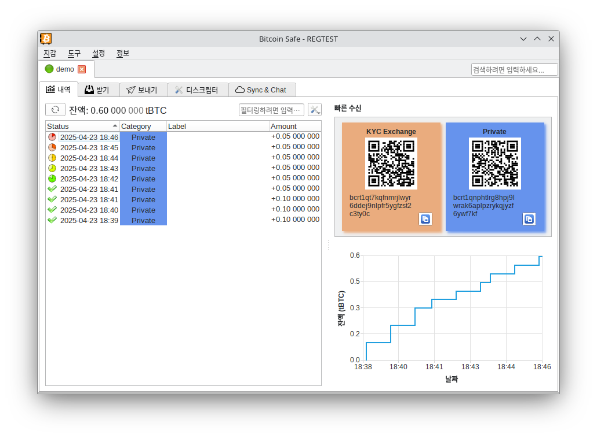
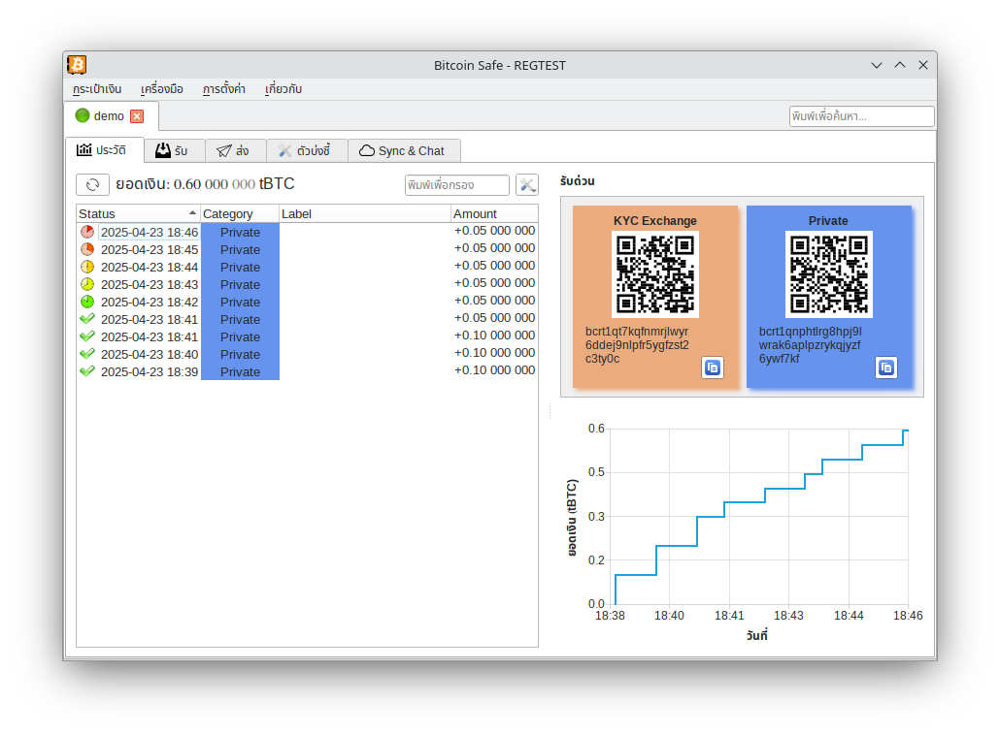

###  
   

- [🇺🇸 English]()
- [🇨🇳 Chinese - 简体中文]()
- [🇪🇸 Spanish - español de España]()
- [🇯🇵 Japanese - 日本語]()
- [🇷🇺 Russian - русский]()
- [🇵🇹 Portuguese - português europeu]()
- [🇮🇳 Hindi - हिन्दी]()
- [🇮🇹 Italian - italiano]()
- [🇫🇷 French - Français]()
- [🇩🇪 German - Deutsch]()
- [🇲🇲 Burmese - မြန်မာ]()
- [🇰🇷 Korean - 한국어]()
- [🇹🇭 Thai - ภาษาไทย]() 

 
 

#### 🇺🇸 English

{ .img-fluid .mb-5 } 

#### 🇨🇳 Chinese - 简体中文

{ .img-fluid .mb-5 } 

#### 🇪🇸 Spanish - español de España

{ .img-fluid .mb-5 } 

#### 🇯🇵 Japanese - 日本語

{ .img-fluid .mb-5 } 

#### 🇷🇺 Russian - русский

{ .img-fluid .mb-5 } 

#### 🇵🇹 Portuguese - português europeu

{ .img-fluid .mb-5 } 

#### 🇮🇳 Hindi - हिन्दी

{ .img-fluid .mb-5 } 

#### 🇮🇹 Italian - italiano

{ .img-fluid .mb-5 } 

<!-- #### Arabic - العربية -->

#### 🇫🇷 French - Français

{ .img-fluid .mb-5 } 

#### 🇩🇪 German - Deutsch

{ .img-fluid .mb-5 } 

#### 🇲🇲 Burmese - မြန်မာ

{ .img-fluid .mb-5 } 

#### 🇰🇷 Korean - 한국어

{ .img-fluid .mb-5 } 

#### 🇹🇭 Thai - ภาษาไทย

{ .img-fluid .mb-5 } 
