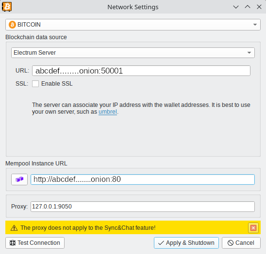

###   
 

- Set the proxy to `127.0.0.1:9050`  if you have a tor running  
- Set the electrum server to `abcdef.onion:50001`  where `50001` is the default port for non encrypted electrum transport  (tor is encrypted anyway)
- Set the mempool space instance to `http://abcdef.onion` or `http://abcdef.onion:80` (it should also work in the tor browser)

  

 
 
 { .img-fluid .mb-5 }
 