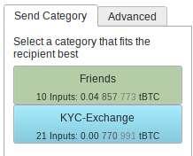

##  
<!--   -->

 
<!--   -->

###  Secure Bitcoin storage made Easy
<!-- - ❌ 2-of-3 Multisignature is complex to use in other wallets -->
<!-- - 2-of-3 Multi-signature is a good choice  
    - Robust against loss or leak of 1 seed  -->
- The  <a  href="/page/setup-multisignature-wallet" role="button">setup wizard</a>    makes Single and  Multi-signature **easy**   for non-technical people
    --> Simply follow each step to set up a safe wallet.   
    
    - The <a  href="/page/pdf-export" role="button">   PDF Export</a>   helps you to backup the important wallet descriptor with each seed.
    - Register the Multi-signature with each hardware signer 
    - Includes test receiving and spending from the wallet, to ensure all hardware signers work
 

 

####  Label Synchronization and Backup

 will magically  (through the power of encrypted  <a href="https://nostr.com/ ">nostr</a> messages) 
- <a  href="/page/syncchat" role="button">Synchronize</a> your coin categories and labels across computers
- Backup your coin categories and labels.  All you have to do is  backup a short backup-key.
 

 

####   Multi-party Multi-sig collaboration

Participate in a 3-of-5 Multi-sig wallet?

- After the wallet is created  creates an encrypted group chat  to collaborate and   send PSBTs around to sign. 
- Label synchronization  works of course too.
- For security each participant has to authenticate (a simple click) each other user

 

#### Removing possibilities for mistakes

People have made many expensive mistakes in the past. Most of them can be prevented if people **never**  type a seed into a computer.  prevents you from using  seeds on your computer, and encourages you to use a hardware signer.

-   has full support for the most common hardware signers (e.g.  <a href="https://store.coinkite.com/promo/8BFF877000C34A86F410">Coldcard</a>, 
            <a href="https://store.coinkite.com/promo/8BFF877000C34A86F410">Coldcard Q</a>, 
            <a href="https://shiftcrypto.ch/bitbox02/?ref=MOB4dk7gpm">Bitbox02</a>, 
            <a href="https://store.blockstream.com/?code=XEocg5boS77D">Blockstream Jade</a>,    
            <a href="https://trezor.io">Trezor</a>,
            <a href="https://foundation.xyz/passport">Foundation Passport</a>,
            <a href="https://keyst.one">Keystone</a>,
            <a href="https://shop.ledger.com/pages/ledger-nano-s-plus">Ledger</a>,
            <a href="https://specter.solutions/hardware">Specter DIY</a>)  
-  includes screenshots instructions for each hardware signer to guide you through every step 
    

        
    

   

 

#### Organize addresses in coin categories

  
 
- You can cluster addresses in **coin categories**. It's easier than labeling each address.
- For each PSBT you create you select the matching coin category and    will select the inputs only from it.   
-    warns if a PSBT or transaction combines coin categories.

 
